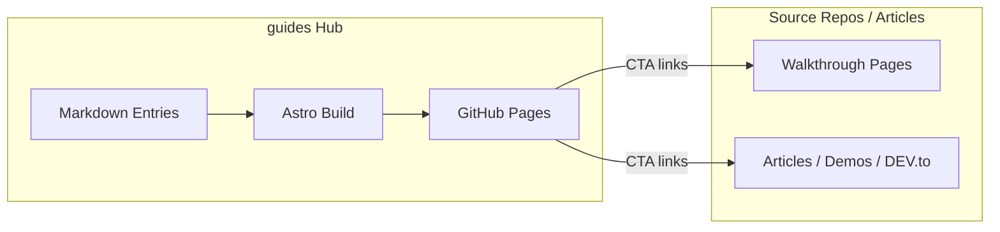

# Design Document

## Overview

**guides** is a static Astro hub that indexes AWS walkthroughs and articles. Each content file is a short intro with metadata. Full guides remain on source repo Pages sites or external article URLs (for example DEV.to).

### Design Goals

- Fully set up site on first ship (not a blank scaffold)
- Manual Markdown authoring only for v1
- Dates and categories as first-class browse paths
- Home-page search, type/category filters, and pagination
- Light/dark theme toggle aligned with Starlight walkthroughs (`starlight-theme` localStorage)
- GitHub Pages deploy via Actions
- Keep content model simple enough to edit without tooling

### Architecture Diagram



## Architecture

### Stack

| Piece | Choice |
|-------|--------|
| Framework | Astro 5 (static output) |
| Content | Astro content collections + Markdown + Zod |
| Styling | Global CSS variables; light/dark via `data-theme` |
| Search / filters | Client-side on home (no search backend) |
| Pagination | Client-side, 12 per page, URL `?page=` |
| SEO | Canonical, Open Graph, Twitter cards, `public/og.png` |
| Feeds | `@astrojs/sitemap`, `@astrojs/rss` |
| Hosting | GitHub Pages |
| Deploy | GitHub Actions (`actions/deploy-pages`) |
| Content sync | Manual |

### Site map

Paths below are under site base `/guides/`.

```text
/                         Home — latest entries, search, filters, pagination
/[slug]/                  Entry detail
/categories/              Category index
/categories/[category]/  Entries in category
/rss.xml                  RSS feed
/sitemap-index.xml        Sitemap
```

### Category set (v1)

| Category | Examples |
|----------|----------|
| `networking` | Private connectivity, interconnect, IPAM, VPC Lattice |
| `dns` | Route 53 multi-account |
| `serverless` | Event-driven, Lambda, IAM Policy Guard |
| `storage` | S3 Files, annotations, vectors |
| `containers` | ECS Express Mode, EKS decision guides |
| `iot` | ESP32 / AWS IoT |
| `tooling` | Amazon Q, GitHub Actions |
| `general` | Catch-all |

### Type set

- `walkthrough`
- `article`

## Content model

### Collection: `guides`

Path: `src/content/guides/*.md`

```yaml
---
title: Classic Route 53 multi-account DNS
date: 2026-06-22
type: walkthrough
category: dns
tags: [route53, multi-account, private-dns, terraform]
summary: Share one private hosted zone across three accounts and two regions.
walkthrough_url: https://jajera.github.io/route53-classic-multi-account-walkthrough/
demo_url: https://github.com/jajera/route53-classic-multi-account-walkthrough
draft: false
---

Short intro body in Markdown.
```

### Validation rules

- `title`, `date`, `type`, `category`, `summary` required
- At least one of `walkthrough_url` or `article_url` recommended for published entries
- `draft: true` excluded from all public lists and RSS

## UI design

### Layout

- Header: brand `Guides`, search field, Starlight-style sun/moon theme toggle
- Main: page content
- Footer: short blurb + GitHub + RSS

### Home

- Two-column entry grid (stacks to one column on small screens)
- Type + Category `<select>` filters
- Client search (Ctrl/Cmd+K focuses search)
- Pagination when filtered results exceed page size
- Cards are interactive containers (clickable whole card)

### Detail page

- Title, meta row (date, type, category, tags)
- Body
- CTA group: Open walkthrough / Read article / View demo (only if URL present)

### Visual direction

- Starlight-inspired indigo dark theme; light theme via `data-theme="light"`
- Orange brand accent (`#f97316`)
- System sans stack (Starlight-like)
- Aotearoa-themed default OG image at `public/og.png`
- Prefer `li[hidden] { display: none }` so grid `display: flex` does not override filtering

## Directory structure

```text
guides/
├── .github/workflows/deploy.yml
├── .kiro/specs/guides-hub/
├── docs/
│   └── walkthrough.md
├── public/
│   ├── .nojekyll
│   ├── favicon.ico
│   ├── favicon.svg
│   └── og.png
├── src/
│   ├── content/
│   │   ├── config.ts
│   │   └── guides/
│   │       └── YYYY-MM-DD-slug.md
│   ├── layouts/
│   │   └── BaseLayout.astro
│   ├── pages/
│   │   ├── index.astro
│   │   ├── [slug].astro
│   │   ├── rss.xml.js
│   │   └── categories/
│   │       ├── index.astro
│   │       └── [category].astro
│   ├── styles/
│   │   └── global.css
│   ├── lib/
│   │   ├── guides.ts
│   │   └── paths.ts
│   └── components/
│       ├── EntryCard.astro
│       ├── EntryMeta.astro
│       ├── CtaLinks.astro
│       └── ThemeToggle.astro
├── astro.config.mjs
├── package.json
├── tsconfig.json
└── README.md
```

## Deploy design

### GitHub Actions

1. Trigger on push to `main`
2. `npm ci` + `npm run build`
3. Upload `dist/` as Pages artifact
4. Deploy with `actions/deploy-pages`

### Repo settings (manual once)

- Pages source: GitHub Actions
- Public repo under `jajera/guides`

## Correctness properties

### Property 1: Build succeeds

`npm run build` exits 0 and emits HTML for home, categories, RSS/sitemap, and each published entry.

### Property 2: Drafts hidden

No draft entry appears in home, category listings, or RSS.

### Property 3: Base path correct

Built asset URLs and internal links work under `/guides/` base path. Entry detail URLs are `/guides/<slug>/` (not `/guides/guides/<slug>/`).

### Property 4: No Jekyll interference

`.nojekyll` exists in published output.

## Error handling

| Scenario | Handling |
|----------|----------|
| Missing required front matter | Astro content collection validation fails at build |
| Unknown category | Schema enum rejects at build |
| Broken outbound URL | Author responsibility; spot-check before release |
| Empty category | Category page can render empty state; index may show zero count |
| Favicon request | Served from `public/`; avoids `[slug]` catch-all warnings |

## Testing strategy

- Local: `npm run build` + `npm run preview`
- Manual: open home, search, filters, pagination, theme toggle, one category, one entry CTA
- No automated e2e in v1

## Intentionally excluded

- Auto-import from GitHub API / gitprofile
- CMS, WordPress, Notion sync
- Server-side / Pagefind full-text search
- Comments
- Multi-author auth
- Custom domain (optional later)
- S3/CloudFront hosting
- Dedicated `/types/*` index pages (home filters cover type browsing)
